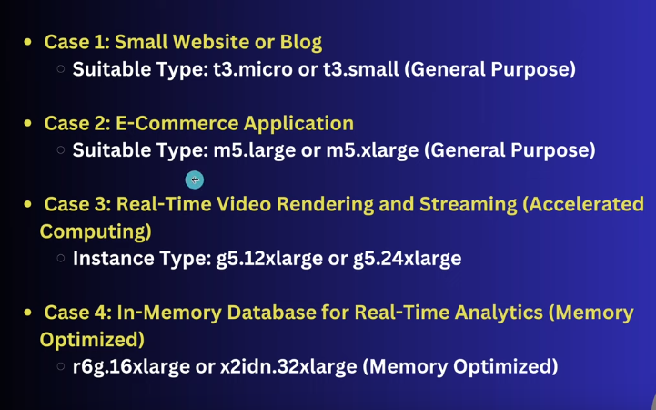
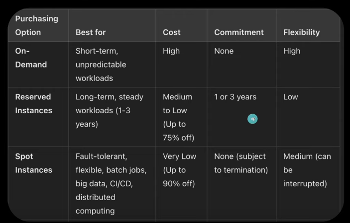
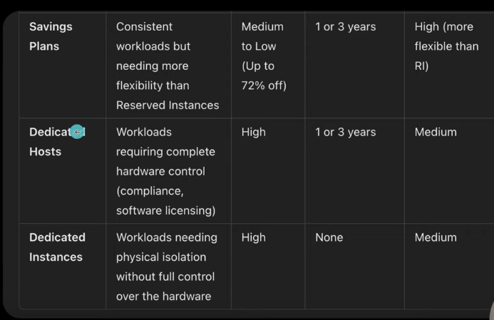

<br>
<br>

# `#01 Virtualization, Hypervisor, Type of Hypervisor.`

<br>

### ভার্চুয়ালাইজেশন কী?  
ভার্চুয়ালাইজেশন হলো একটি প্রযুক্তি যার মাধ্যমে হার্ডওয়্যার বা সফটওয়্যারের রিসোর্সগুলোর একটি ভার্চুয়াল সংস্করণ তৈরি করা হয়। এর মধ্যে অপারেটিং সিস্টেম, স্টোরেজ ডিভাইস, নেটওয়ার্ক রিসোর্স ইত্যাদি অন্তর্ভুক্ত। এটি মূলত একটি ফিজিক্যাল সিস্টেমের উপর ভার্চুয়াল সিস্টেম তৈরি করতে ব্যবহৃত হয়। 


### হাইপারভাইজার কী?  
হাইপারভাইজার হলো একটি সফটওয়্যার লেয়ার, যা একটি ফিজিক্যাল সিস্টেমের উপর ভার্চুয়াল মেশিন (VM) তৈরি এবং পরিচালনা করার কাজ করে। এটি হার্ডওয়্যার এবং ভার্চুয়াল মেশিনগুলোর মধ্যে মধ্যস্থতা করে।  


### হাইপারভাইজারের প্রকারভেদ  
হাইপারভাইজার প্রধানত দুটি প্রকারের হয়ে থাকে:  

1. **টাইপ ১ (Bare-metal Hypervisor)**  
   - এটি সরাসরি হার্ডওয়্যারের উপর ইনস্টল করা হয়।  
   - উদাহরণ: VMware ESXi, Microsoft Hyper-V, Xen  

2. **টাইপ ২ (Hosted Hypervisor)**  
   - এটি একটি অপারেটিং সিস্টেমের উপর ইনস্টল করা হয়।  
   - উদাহরণ: VMware Workstation, VirtualBox  


### হাইপারভাইজারের কাজ করার পদ্ধতি  
- **টাইপ ১**:  
  সরাসরি হার্ডওয়্যারের সাথে কাজ করে এবং ভার্চুয়াল মেশিনকে হার্ডওয়্যার রিসোর্স ব্যবহার করতে দেয়। এটি দ্রুত এবং দক্ষ।  
- **টাইপ ২**:  
  প্রথমে অপারেটিং সিস্টেমের সাথে কাজ করে এবং পরে ভার্চুয়াল মেশিনকে রিসোর্স প্রদান করে। এটি তুলনামূলক ধীর।  

### হাইপারভাইজারের সুবিধা  
1. একাধিক অপারেটিং সিস্টেম একই হার্ডওয়্যারে চালানো যায়।  
2. হার্ডওয়্যার রিসোর্সের কার্যকর ব্যবহার।  
3. স্কেলযোগ্যতা ও ফ্লেক্সিবিলিটি।  
4. সিস্টেম টেস্টিং ও ডেভেলপমেন্টের জন্য আদর্শ।  

### হাইপারভাইজারের অসুবিধা  
1. টাইপ ২ হাইপারভাইজারের ক্ষেত্রে কম পারফরম্যান্স।  
2. সাইবার সিকিউরিটি ঝুঁকি বাড়তে পারে।  
3. ভার্চুয়াল মেশিন বেশি হলে হার্ডওয়্যার ওভারলোড হতে পারে।  


<br>
<br>

# `#02 Cloud Computing, LaaS, PaaS, SaaS: `

<br>
<br>

### ক্লাউড কম্পিউটিং কী?  
ক্লাউড কম্পিউটিং হলো একটি প্রযুক্তি যেখানে ইন্টারনেটের মাধ্যমে বিভিন্ন পরিষেবা (যেমন: সার্ভার, স্টোরেজ, ডেটাবেস, নেটওয়ার্কিং, সফটওয়্যার) সরবরাহ করা হয়। এর মাধ্যমে আপনি সরাসরি আপনার লোকাল মেশিনে কিছু ইনস্টল না করেও দূরবর্তী সার্ভারের মাধ্যমে ডেটা অ্যাক্সেস এবং পরিচালনা করতে পারেন।


### গুগল ড্রাইভ ও গুগল ফটো কি ক্লাউড কম্পিউটিং?  
হ্যাঁ, **গুগল ড্রাইভ** এবং **গুগল ফটো** ক্লাউড কম্পিউটিং-এর উদাহরণ। এরা ক্লাউড স্টোরেজ সেবা সরবরাহ করে যেখানে ব্যবহারকারীরা তাদের ফাইল, ছবি ইত্যাদি অনলাইনে সংরক্ষণ করতে পারে এবং যেকোনো জায়গা থেকে সেগুলো অ্যাক্সেস করতে পারে।  


### ৫টি ক্লাউড কম্পিউটিং কোম্পানির নাম  
1. **Amazon Web Services (AWS)**  
2. **Microsoft Azure**  
3. **Google Cloud Platform (GCP)**  
4. **IBM Cloud**  
5. **Oracle Cloud**  


### ক্লাউড কম্পিউটিংয়ে ভার্চুয়ালাইজেশন কিভাবে ব্যবহৃত হয়?  
ক্লাউড পরিষেবা সরবরাহকারী কোম্পানিগুলো ভার্চুয়ালাইজেশন ব্যবহার করে ফিজিক্যাল হার্ডওয়্যারের উপর ভার্চুয়াল মেশিন তৈরি করে।  
- **রিসোর্স শেয়ারিং**: একাধিক ভার্চুয়াল মেশিন এক ফিজিক্যাল সার্ভারে চালানো যায়।  
- **স্কেলিং**: ভার্চুয়াল মেশিনগুলো সহজেই স্কেল করা যায়।  
- **রিসোর্স ইফিশিয়েন্সি**: ভার্চুয়ালাইজেশনের মাধ্যমে হার্ডওয়্যার রিসোর্সগুলো সর্বোচ্চভাবে ব্যবহার করা হয়।  


### কেন ক্লাউড কম্পিউটিং প্রয়োজন?  
1. **ডেটা ব্যাকআপ**: ডেটা নিরাপদে সংরক্ষণ এবং ব্যাকআপ নেওয়া সহজ।  
2. **স্কেলেবল**: সহজেই রিসোর্স বাড়ানো বা কমানো যায়।  
3. **কস্ট-ইফেক্টিভ**: নিজস্ব সার্ভার সেটআপ করার চেয়ে খরচ কম।  
4. **অ্যাক্সেসিবিলিটি**: ইন্টারনেটের মাধ্যমে যেকোনো সময়, যেকোনো জায়গা থেকে ডেটা অ্যাক্সেস করা যায়।  

**উদাহরণ:**  
ইয়াসিন একটি ওয়েবসাইট চালু করতে চায়, যা দ্রুতগতির, সুরক্ষিত, এবং ব্যাকআপ সুবিধাসহ হতে হবে। ব্যবহারকারী বাড়ার সাথে সাথে তাকে স্কেল করতে হবে। ইয়াসিন **AWS**-এর মতো একটি ক্লাউড সার্ভিস বেছে নিতে পারে, যেখানে **EC2 (IaaS)** দিয়ে ভার্চুয়াল সার্ভার তৈরি করে, **RDS (PaaS)** দিয়ে ডাটাবেস পরিচালনা করবে, এবং **S3**-তে ডেটা স্টোর করবে।  


### IaaS, PaaS, SaaS (স্টোর মাল্লের উদাহরণ):  
1. **IaaS (Infrastructure as a Service)**:  
   সার্ভার বা নেটওয়ার্কিং ইত্যাদি সরাসরি ইন্টারনেটের মাধ্যমে পাওয়া যায়।  
   - **উদাহরণ:** একটি বড় স্টোর মল যদি শুধু জায়গা ভাড়া দেয় এবং আপনি নিজের দোকান সেটআপ করেন।  
   - ক্লাউড উদাহরণ: Amazon EC2, Microsoft Azure VM  

2. **PaaS (Platform as a Service)**:  
   সফটওয়্যার ডেভেলপমেন্টের জন্য প্ল্যাটফর্ম সরবরাহ করে।  
   - **উদাহরণ:** মল যদি আপনার দোকান সেটআপের জন্য সব সুবিধা (ফার্নিচার, লাইট) দিয়ে দেয়।  
   - ক্লাউড উদাহরণ: Google App Engine, AWS Elastic Beanstalk  

3. **SaaS (Software as a Service)**:  
   সরাসরি সফটওয়্যার ব্যবহার করার সুবিধা দেয়।  
   - **উদাহরণ:** মলে একটি রেডিমেড দোকান, যেখানে শুধু গিয়ে আপনি পণ্য কিনতে পারেন।  
   - ক্লাউড উদাহরণ: Gmail, Google Drive, Microsoft Office 365  


### পাবলিক, প্রাইভেট, এবং হাইব্রিড ক্লাউড  
1. **পাবলিক ক্লাউড**:  
   সকলের জন্য উন্মুক্ত এবং অনলাইনে অ্যাক্সেসযোগ্য।  
   - উদাহরণ: Google Cloud, AWS  

2. **প্রাইভেট ক্লাউড**:  
   নির্দিষ্ট প্রতিষ্ঠানের জন্য তৈরি করা হয়।  
   - উদাহরণ: বড় কোম্পানির নিজস্ব ডেটা সেন্টার  

3. **হাইব্রিড ক্লাউড**:  
   পাবলিক এবং প্রাইভেট ক্লাউডের সংমিশ্রণ।  
   - উদাহরণ: একটি কোম্পানি নিজস্ব ডেটা সংরক্ষণ করে এবং পাবলিক ক্লাউড ব্যবহার করে ব্যাকআপের জন্য।  


### ক্লাউড সেবা প্রদানকারীর কিছু বৈশিষ্ট্য  
1. **স্কেলেবিলিটি**  
2. **ডেটা ব্যাকআপ এবং রিকভারি**  
3. **সিকিউরিটি ফিচার (এনক্রিপশন, ফায়ারওয়াল)**  
4. **পে-অ্যাস-ইউ-গো মডেল**  
5. **মাল্টি-রিজিওন অ্যাক্সেস**  
6. **রিয়েল-টাইম মনিটরিং এবং অ্যানালিটিক্স**  


<br>
<br>

# `#03 IAM,User,Group,MFA,AWS-CLI`

<br>

### **IAM (Identity and Access Management)**  
IAM-এর পূর্ণরূপ হলো **Identity and Access Management**। এটি AWS-এ একটি গ্লোবাল সার্ভিস যা আপনাকে ব্যবহারকারীদের পরিচয় যাচাই (identity) এবং বিভিন্ন রিসোর্সে তাদের অ্যাক্সেস নিয়ন্ত্রণ করতে সাহায্য করে।  


### **IAM দিয়ে কী করা যায়?**  
1. **ব্যবহারকারী এবং গ্রুপ ম্যানেজমেন্ট**  
2. **পারমিশন নিয়ন্ত্রণ**  
3. **AWS রিসোর্সের নিরাপত্তা নিশ্চিত করা**  
4. **রোল তৈরি এবং নির্দিষ্ট অ্যাক্সেস দেওয়া**  


### **Root User এবং IAM কেন ব্যবহার করব?**  
- **Root User**:  
  যখন আমরা AWS অ্যাকাউন্ট তৈরি করি, তখন আমরা "Root User" হিসাবে লগইন করি। Root User-এর সর্বোচ্চ পারমিশন থাকে এবং এটি সংবেদনশীল কাজের জন্য ব্যবহার করা উচিত, যেমন বিলিং ম্যানেজমেন্ট বা অ্যাকাউন্ট সেটআপ।  
  **কিন্তু:** নিরাপত্তার জন্য Root User দিয়ে প্রতিদিনের কাজ করা ঠিক নয়।  
   
- **IAM User**:  
  Root User থেকে আলাদা, IAM User নির্দিষ্ট কাজ বা রিসোর্সে সীমিত অ্যাক্সেস পায়। এই কারণে, নিরাপত্তা ও ব্যবস্থাপনা সহজ হয়।  


### **User এবং Group কী?**
1. **User (ব্যবহারকারী)**:  
   ব্যবহারকারী হলো একটি ব্যক্তিগত পরিচিতি যা AWS-এ নির্দিষ্ট কাজ করার জন্য তৈরি করা হয়।  
   উদাহরণ: ইয়াসিন নামে একটি ব্যবহারকারী তৈরি করা হয়েছে, যাকে শুধুমাত্র S3 বালতি ম্যানেজ করার পারমিশন দেওয়া হয়েছে।  

2. **Group (গ্রুপ)**:  
   গ্রুপ হলো একাধিক ব্যবহারকারীকে একত্রিত করার একটি পদ্ধতি। গ্রুপের মাধ্যমে একাধিক ব্যবহারকারীকে একই পারমিশন দেওয়া যায়।  
   উদাহরণ: "ডেভেলপার" নামে একটি গ্রুপ তৈরি করা হয়েছে, যেখানে ইয়াসিন ও আরাফাত অন্তর্ভুক্ত রয়েছে।  


### **গ্রুপ ব্যবহারের সুবিধা:**  
- গ্রুপের মাধ্যমে একাধিক ব্যবহারকারীকে একই পারমিশন দেওয়া সহজ।  
- প্রতিটি ব্যবহারকারীর জন্য আলাদা আলাদা পারমিশন সেট করার পরিবর্তে, একটি গ্রুপে অ্যাড করে তাদের একই রকম অ্যাক্সেস দেওয়া যায়।  


### **কীভাবে User তৈরি করবেন?**  
1. **Step 1: AWS Management Console-এ লগইন করুন।**  
2. **Step 2: IAM সেকশনে যান।**  
3. **Step 3: "Users" অপশন থেকে "Add User" ক্লিক করুন।**  
4. **Step 4: নতুন ব্যবহারকারীর নাম (যেমন: Yasin) লিখুন এবং লগইন টাইপ (কনসোল অ্যাক্সেস বা প্রোগ্রাম্যাটিক অ্যাক্সেস) নির্বাচন করুন।**  
5. **Step 5: পারমিশন সেট করুন।**  
6. **Step 6: ব্যবহারকারীর জন্য পাসওয়ার্ড তৈরি করুন এবং এটি সংরক্ষণ করুন।**  


### **কীভাবে গ্রুপ তৈরি করবেন এবং পারমিশন অ্যাসাইন করবেন?**  
1. **Step 1: IAM কনসোলে যান।**  
2. **Step 2: "Groups" অপশনে ক্লিক করুন এবং "Create New Group" সিলেক্ট করুন।**  
3. **Step 3: গ্রুপের নাম দিন (যেমন: Developer)।**  
4. **Step 4: গ্রুপে প্রয়োজনীয় পারমিশন যোগ করুন (যেমন: S3 Full Access)।**  
5. **Step 5: গ্রুপ তৈরি হয়ে গেলে, ব্যবহারকারী (Yasin এবং Arafat) এই গ্রুপে যোগ করুন।**  


### **কীভাবে Yasin এবং Arafat-কে গ্রুপে যোগ করবেন?**  
1. IAM-এ "Users" সেকশনে যান।  
2. Yasin-এর প্রোফাইলে ক্লিক করুন।  
3. "Add to Group" অপশন থেকে "Developer" গ্রুপ সিলেক্ট করুন।  
4. একইভাবে Arafat-এর জন্য করুন।  


### **গ্রুপ ব্যবহারের উদাহরণ:**  
ধরুন, আপনি একটি "S3 Full Access" গ্রুপ তৈরি করেছেন এবং ইয়াসিন এবং আরাফাতকে এতে যোগ করেছেন। এই গ্রুপের পারমিশন অনুযায়ী, ইয়াসিন এবং আরাফাত উভয়েই S3 বালতি ম্যানেজ করতে পারবে। এতে আলাদাভাবে প্রত্যেক ব্যবহারকারীর জন্য পারমিশন সেট করার ঝামেলা থাকে না।  


### **IAM-এর সুবিধা এবং সীমাবদ্ধতা:**  
#### **সুবিধা:**  
1. ব্যবহারকারীদের জন্য নির্দিষ্ট এবং সুনির্দিষ্ট পারমিশন সেট করা যায়।  
2. রিসোর্সে অ্যাক্সেস নিয়ন্ত্রণ করা সহজ।  
3. গ্রুপ ব্যবহারের মাধ্যমে ব্যবস্থাপনা দ্রুত এবং কার্যকর।  

#### **সীমাবদ্ধতা:**  
1. এটি সঠিকভাবে সেটআপ করতে না পারলে নিরাপত্তা ঝুঁকি থাকতে পারে।  
2. IAM কনফিগারেশনের জন্য সময় এবং অভিজ্ঞতা প্রয়োজন।  

<br>

**Also see this topics:**
- #### **MFA**
- #### **Different ways of using services**
- #### **Use CLI**
- #### **CLI Configuration with Access key**
- #### **Change Password setting from IAM**


<br>
<br>

# `#04 AWS EC2 (Amazon Elastic Computing): `

<br>
<br>

### **Some information about AWS EC2:**

- AWS EC2(Amazon Elastic Compute Cloud) is a cloud service that provides resizable virtual servers, called instances, which you can use to run applications.

- Imagine you're running a business and need a server to host your website or application. Instead of buying and managing physical servers, AWS EC2 lets you rent virtual servers in the cloud. These virtual servers are called instances.

- We can control the type of OS, RAM, CPU, Disk Space, Network/Firewall .

### **Some import terms about AWS EC2 SERVER:**

- **Instance Type:** Select the hardware capacity(e.g. CPU,Memory)

- **AMI(Amazon Machine Image):** Choose the operating system and software (linux,mac,windows).

- **Storage:** Configure the type and size of storage(e.g. EBS Volume).

- **Security Gropus:** Set up firewall rules to control inbound/outbound traffic.

- **Key Pair:** Create or use an existing key pair for SSH access.

- **Network Settings: Configure VPC, subnet and assign public or private IP addresses.

- **IAM Role:** Attach an IAM role for permissions to access other AWS resources.

- **User Data:** Add scripts to be executed when the instance starts.

- **Elastic IP:** Optionally associate a static IP address for consistent public access.

### `Make a EC2`

- 1. In the search bar search EC2
- 2. Launch Instance
- 3. Region: `(we we create a instance. If, our location is in india. Then, it's build on india data center of AWS)`
- 4. Then, `Name and Tag` then `AMI(Amazon Machine Image)->Here, i select Amazon Linux.`  
- 5. Instance type default "micro instance type" by clicking we can change it.
- 6. key pair (login) : (by using this we can sequrly connet our instance).
- 7. Network setting: ()
- 8. Advance option: (user data) pase the script below:

```bash
#!/bin/bash 

sudo yum update -y
sudo systemctl start httpd
sudo systemctl enable httpd

######
# create a simple html file verify the web server:
echo "<html><h1>Welcome to Apache Web Server of Amazon LInux! </h1></html>" > /var/www/html/index.html

```

### **AWS EC2-এর Inbound এবং Outbound Rules Explained in Bangla**

**Security Group** হলো AWS EC2 instance-এর জন্য একটি ভার্চুয়াল ফায়ারওয়াল। এটি **Inbound Rules** এবং **Outbound Rules** ব্যবহার করে নেটওয়ার্ক ট্রাফিক নিয়ন্ত্রণ করে। 


### ১. **Inbound Rules**:
Inbound Rules নির্ধারণ করে কোন ট্রাফিক (ডেটা বা রিকোয়েস্ট) EC2 instance-এর দিকে আসতে পারবে। অর্থাৎ, **কোনো সার্ভিসে অ্যাক্সেস দিতে হলে Inbound Rules সেট করতে হবে।**

#### **উদাহরণ**:
তুমি যদি তোমার instance-এ একটি **Apache HTTP Server** চালু করো, তাহলে Inbound Rule-এ HTTP (port 80)-এর অনুমতি দিতে হবে।

#### **Inbound Rule সেট করার উদাহরণ**:
- **HTTP Access**:
  - Protocol: TCP
  - Port: 80
  - Source: `0.0.0.0/0` (সারা বিশ্বের জন্য উন্মুক্ত) অথবা `203.0.113.0/24` (নির্দিষ্ট IP রেঞ্জের জন্য)
  
- **SSH Access**:
  - Protocol: TCP
  - Port: 22
  - Source: `0.0.0.0/0` (সতর্কতাঃ এটি নিরাপত্তাহীন হতে পারে। শুধু তোমার IP উল্লেখ করো।)

#### **Inbound Rules চেক করার ধাপ**:
1. **AWS Console** > **EC2 Dashboard** > **Security Groups**-এ যাও।
2. তোমার instance-এর Security Group সিলেক্ট করো।
3. **Inbound Rules** ট্যাব থেকে দেখো বা নতুন Rule অ্যাড করো।


### ২. **Outbound Rules**:
Outbound Rules নির্ধারণ করে কোন ট্রাফিক EC2 instance থেকে বাইরে যেতে পারবে। অর্থাৎ, তোমার instance যদি ইন্টারনেটে অ্যাক্সেস নিতে চায়, তাহলে Outbound Rule সেট করতে হবে।

#### **উদাহরণ**:
তুমি যদি তোমার instance থেকে **ইন্টারনেট বা অন্য সার্ভার**-এ রিকোয়েস্ট পাঠাতে চাও, তাহলে Outbound Rule-এ `0.0.0.0/0` উল্লেখ করতে হবে।

#### **Default Outbound Rule**:
AWS Security Group সাধারণত ডিফল্টভাবে Outbound Traffic-এর জন্য সব অনুমতি দেয়। উদাহরণ:
- Protocol: All
- Port Range: All
- Destination: `0.0.0.0/0` (সব জায়গায় ট্রাফিক পাঠানোর অনুমতি)


### ৩. **Inbound এবং Outbound Rules-এর পার্থক্য**:
| **Aspect**         | **Inbound Rule**                                       | **Outbound Rule**                                        |
|---------------------|--------------------------------------------------------|---------------------------------------------------------|
| **Traffic Direction** | বাহির থেকে EC2 instance-এ ট্রাফিক প্রবেশ করতে দেয়।       | EC2 instance থেকে বাইরে ট্রাফিক পাঠানোর অনুমতি দেয়।        |
| **Example Use Case** | SSH, HTTP, HTTPS অ্যাক্সেস।                            | ইন্টারনেট অ্যাক্সেস বা ডেটা API-তে পাঠানো।               |
| **Default Rule**     | সব ব্লক করা (কিছু অনুমতি দিলে, তখনই অনুমতি পায়)।         | ডিফল্টভাবে সব অনুমোদিত।                                  |


### ৪. **প্রায়োগিক উদাহরণ**:
তোমার EC2 instance-এ একটি Apache Web Server (HTTP) চালু করতে হলে:
1. **Inbound Rule**: HTTP (port 80) ট্রাফিকের জন্য `0.0.0.0/0` অথবা নির্দিষ্ট IP।
2. **Outbound Rule**: ডিফল্ট `0.0.0.0/0` (ইন্টারনেট অ্যাক্সেসের জন্য)।

#### **HTTP Access-এর জন্য Inbound Rule**:
```plaintext
Type: HTTP
Protocol: TCP
Port: 80
Source: 0.0.0.0/0
```

#### **Outbound Rule ডিফল্টভাবে**:
```plaintext
Type: All traffic
Protocol: All
Port: All
Destination: 0.0.0.0/0
```

### ৫. **নিরাপত্তার জন্য টিপস**:
1. SSH Access (port 22)-এ **সারা বিশ্বে উন্মুক্ত** (0.0.0.0/0) না করে, শুধুমাত্র তোমার নির্দিষ্ট **Public IP**-এর জন্য সীমাবদ্ধ করো।
2. **Inbound Rules**-এ অপ্রয়োজনীয় রুল যুক্ত করো না।
3. HTTPS (port 443)-এর জন্য Inbound Rule ব্যবহার করো যদি সিকিওর সার্ভার সেটআপ করা হয়।


<br>
<br>

# `#05 AWS EC2 (SSH Connection): `

<br>
<br>

### **For windows use `putty software`**
- `1st open puTTYgen, then load then save private file(in .ppk format).`
- `Now, open putty software, in host name or ip address use public ipv4 address .`
- `Left side select SSH->Auth->Credential->(private key file for authenticator)->(load the file in .ppk format)->click open.`
- `Type ec2-user`

<br>

### **For linux:**
#### ১. **ফাইলের পারমিশন ঠিক করা:**
```bash
chmod 400 first_key.pem
```
এটি `.pem` ফাইলকে শুধুমাত্র তোমার ব্যবহার করার অনুমতি দেবে (read-only)। 

#### ২. **পুনরায় SSH করার চেষ্টা করো:**
```bash
ssh -i first_key.pem ec2-user@13.215.202.1
```

**NOTE: EC2 is region specific. If we change the region then we can't see the instance of another region. That's why we can view the global ec2 dashboard.**

<br>

`We use t2.micro for learning purpose. But, for some more specific use case we need:`

<br>



<br>

### [aws_all_instance_types_with_pricing](https://aws.amazon.com/ec2/instance-types/)

<br>

### Purchase option: 


