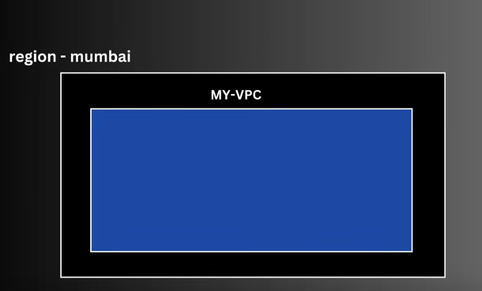

 
 

# `#09 AWS VPC(Virtual Private Cloud): `

 
 

### **VPC কী?**  
VPC (Virtual Private Cloud) হলো একটি **প্রাইভেট, আইসোলেটেড নেটওয়ার্ক**, যা AWS ক্লাউডে তৈরি করা যায়। এখানে আপনি নিরাপদভাবে আপনার রিসোর্স (যেমন EC2, RDS) লঞ্চ ও ম্যানেজ করতে পারেন। এটি ঠিক আপনার ব্যক্তিগত ডাটা সেন্টারের মতো কাজ করে, তবে AWS-এর ইন্টারনাল নেটওয়ার্কের মধ্যে অবস্থিত।  

---

### **VPC কেন দরকার?**  
ধরুন, **১০ জন ব্যবহারকারী** অ্যামাজন ওয়েব সার্ভিস (AWS) ব্যবহার করছে এবং তারা **একটি শেয়ার্ড নেটওয়ার্কে** রয়েছে। এই ক্ষেত্রে, তাদের সকল রিসোর্স একই নেটওয়ার্কের মধ্যে থেকে **নিরাপত্তা ঝুঁকিতে** পড়তে পারে।  

**VPC ব্যবহারের সুবিধা:**  
✅ **আলাদা নেটওয়ার্ক:** আপনি একটি **স্বতন্ত্র নেটওয়ার্ক** পাবেন, যেখানে কেবলমাত্র আপনার রিসোর্স থাকবে।  
✅ **নিরাপত্তা:** VPC-এর মাধ্যমে **প্রাইভেট সাবনেট, ফায়ারওয়াল (Security Groups, NACLs)** ব্যবহার করে ডাটা **সুরক্ষিত** রাখা যায়।  
✅ **কাস্টমাইজেশন:** নিজস্ব **IP রেঞ্জ, সাবনেট, রাউটিং টেবিল** ডিজাইন করা যায়।  

**উদাহরণ:**  
যদি **আপনার নিজস্ব VPC থাকে**, তাহলে AWS **আপনার জন্য একটি আইসোলেটেড নেটওয়ার্ক তৈরি করবে**, যেখানে কেবলমাত্র আপনার রিসোর্স থাকবে, অন্য ব্যবহারকারীরা এটি অ্যাক্সেস করতে পারবে না।  

---

### **Region & Availability Zones**  
AWS **Region** হলো নির্দিষ্ট **ভৌগোলিক এলাকা**, যেখানে AWS ডাটা সেন্টার অবস্থিত। প্রতিটি **Region-এর মধ্যে Availability Zones (AZs)** থাকে, যা একাধিক ডাটা সেন্টার নিয়ে গঠিত।  

#### **উদাহরণ:**  
✅ **Region:** Asia -> East -> **Mumbai**  
✅ **Availability Zones (AZs):** mumbai-1a, mumbai-1b, mumbai-1c  

➡️ **এই ব্যবস্থা কেন দরকার?**  
- যদি একটি ডাটা সেন্টার নষ্ট হয়, তাহলে **অন্য AZ থেকে অ্যাপ সার্ভিস চালু থাকবে** (Single Point of Failure থেকে মুক্তি for any natural disester)।  
- এটি **High Availability & Fault Tolerance** নিশ্চিত করে।  

 
 

### `How CIDR works internally:`

### [cidr_visuliztion_web_sites](https://cidr.xyz/)

